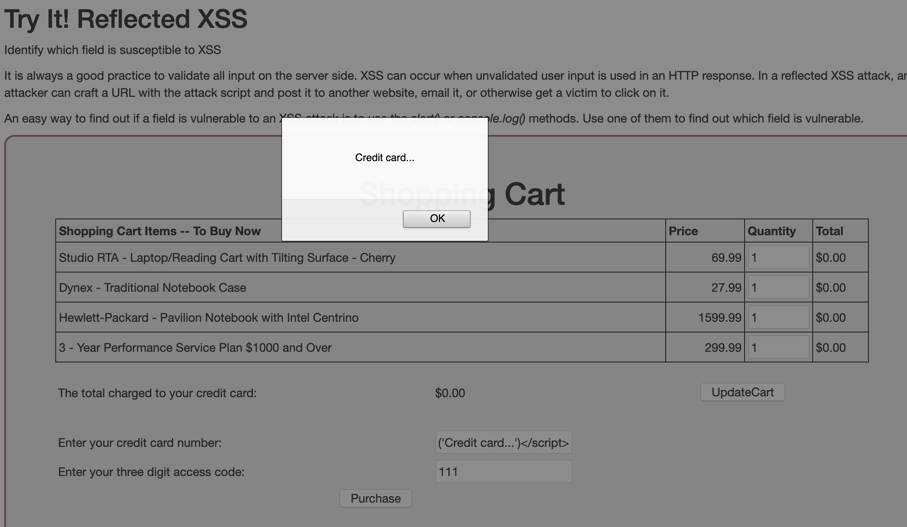
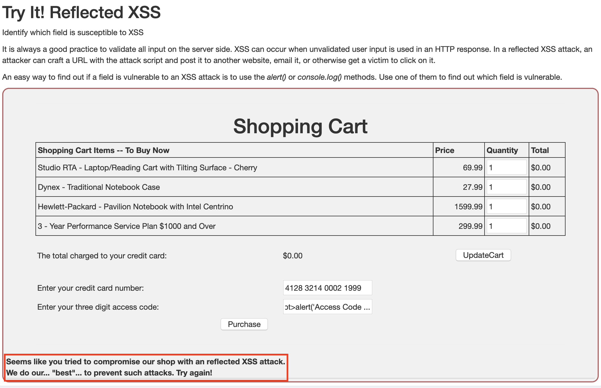

# Exercício 2 - XSS

## Pergunta 2.1
Lição (A7) Cross-site Scripting. 

Passos da resolução

### Passo 1
Não é necessário nehuma ação.

### Passo 2
Na página do segundo passo abrir Consola Web (nas ferramentas de programação do browser).
Nessa consola vamos ver as cookies da sessão com `alert(document.cookie)`.

Depois abrir um novo separador com a mesma página, abrir outra vez a consola e aceder às cookies da mesma maneira. 

Por último temos de comparar os dados obtidos das duas páginas. 

(São os mesmos) 

### Passo 3
Não é necessário nenhuma ação, é apenas exposição de matéria:

#### Most common locations of XSS
* **Search fields** that echo a search string back to the user

* **Input fields** that echo user data
* **Error messages** that return user supplied text
* **Hidden fields** that contain user supplied data
* **Any page that displays user supplied data**
    * Message boards
    * Free form comments
* **HTTP Headers**

### Passo 4
Não é necessário nehuma ação.

#### Why should we care?
XSS attacks may result in: 
* Stealing session cookies
* Creating false requests
* Creating false fields on a page to collect credentials
* Redirecting your page to a "non-friendly" site
* Creating requests that masquerade as a valid user
* Stealing of confidential information
* Execution of malicious code on an end-user system (active scripting)
* Insertion of hostile and inappropriate content

XSS attacks add validity to phishing attacks:
* A valid domain is used in the URL

### Passo 5
Não é necessário nehuma ação.

#### Types of XSS
**Reflected**:
* Malicious content from a user request is displayed to the user in a web browser
* Malicious content is written into the page after from server response
* Social engineering is required
* Runs with browser privileges inherited from user in browser

**DOM-based** (also technically reflected):
* Malicious content from a user request is used by client-side scripts to write HTML to it own page
* Similar to reflected XSS
* Runs with browser privileges inherited from user in browser

**Stored or persistent**:
* Malicious content is stored on the server ( in a database, file system, or other object ) and later displayed to users in a web browser
* Social engineering is not required

### Passo 6
Não é necessário nehuma ação.

#### Reflected XSS scenario
Attacker sends a malicious URL to victim
* Victim clicks on the link that loads malicious web page
* The malicious script embedded in the URL executes in the victim’s browser
* The script steals sensitive information, like the session id, and releases it to the attacker

**Victim does not realize attack occurred**

### Passo 7
Na caixa de input 'Enter your credit card number:' injetamos o script: `` e clicamos
no *Purchase*. Vemos que uma alerta foi criado, podendo concluir assim que este é vulnerável a um ataque.

No caso de tentarmos fazer o mesmo na caixa de input `Enter your three digit access code:` vemos que esta está protegida:

Se tentarmos introduzir qualquer tipo de script nas caixas das quantidades aparece um alerta a informar que só aceita inteiros.

### Passo 8
Não é necesária nenhuma ação.

### Passo 9
Não é necesária nenhuma ação.
#### Reflected and DOM-Based XSS

DOM-based XSS is another form of reflected XSS. Both are triggered by sending a link with inputs that are reflected to the browser. The difference between DOM and 'traditional' reflected XSS is that, with DOM, the payload will never go to the server. It will only ever be processed by the client.

* Attacker sends a malicious URL to victim
* Victim clicks on the link
* That link may load a malicious web page or a web page they use (are logged into?) that has a vulnerable route/handler
* If it’s a malicious web page, it may use it’s own JavaScript to attack another page/url with a vulnerable route/handler
* The vulnerable page renders the payload and executes attack in the user’s context on that page/site
* Attacker’s malicious script may run commands with the privileges of local account

Victim does not realize attack occurred … Malicious attackers don’t use `.
Porém isto vai dar problemas pois a última `/` funciona como separadores de Routes e não funcionaria como o script que queremos. Por isso substituímos essa barra por `%2F` obtendo assim o script final: `http://localhost:8080/WebGoat/start.mvc#test/<script>webgoat.customjs.phoneHome()<%2Fscript>`. Ou então o respetivo URL encode: `http://localhost:8080/WebGoat/start.mvc#test/%3Cscript%3Ewebgoat.customjs.phoneHome()%3C%2Fscript%3E`. 

Depois disto vamos aceder mais uma vez à consola web do browser e na console obtemos a mensagem:
``
phone home said {"lessonCompleted":true,"feedback":"Congratulations. You have successfully completed the assignment.","output":"phoneHome Response is 550178464","assignment":"DOMCrossSiteScripting","attemptWasMade":true}
``

Com isto concluímos que a resposta seria **550178464**.

### Passo 12

Quiz:
* **1** - Solução 4
* **2** - Solução 3
* **3** - Solução 1
* **4** - Solução 2
* **5** - Solução 4
