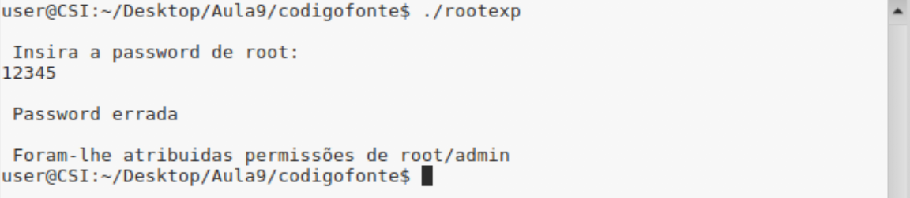
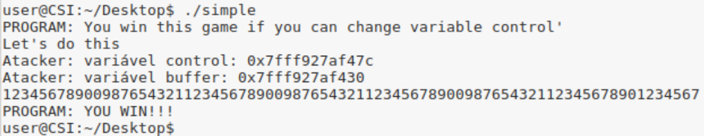

## P1.2
Neste exercício vamos analisar e testar os programs escritos em C **RootExploit.c** e **0-simple.c** .

Em ambos os casos estão presentes a vulnerabilidade de **Stack Buffer Overflow**.

### RootExploit.c

```c
#include <stdio.h>
#include <string.h>

int main(void){
  int pass = 0;
  char buff[4];

  printf("\n Insira a password de root: \n");
  gets(buff);

  if(strcmp(buff, "csi1")){
        printf ("\n Password errada \n");
  }
  else{
    printf ("\n Password correcta \n");
    pass = 1;
  }

  if(pass){
    /* Atribuir permissões de root/admin ao utilizador */
    printf ("\n Foram-lhe atribuidas permissões de root/admin \n");
  }
  return 0;
}
```
No código acima explicitado vemos que existe uma vulnerabilidade **Stack Buffer Overflow**.

Como vemos pelas duas primeiras linhas da função `main()`, são declaradas duas novas variáveis. Estas quando são carregadas para a Stack vão do endereço mais alto para o mais baixo, visto que a Stack assume uma estrutura LIFO.
Assim sendo vemos que a variável `pass` vai ocupar um espaço de 4 bytes, pois é um inteiro, e a variável `buff` vai ocupar os 4 bytes seguintes.

Apesar da Stack assumir uma estrutura LIFO, o processo de escrita nos espaços das variáveis vão do endereço mais baixo para o mais alto. Sabendo isto temos de realçar a 5ª linha da função, onde pedidos ao utilizador um input, que vai ser guardado no buffer `buff`. Depois desse input ser dado nunca é verificado o tamanho e esse descuido pode resultar num **Buffer Overflow**.

Assim sendo, se o input ocupar mais de 4 bytes (para tal basta o input ter mais que 4 caracteres), vai causar um Buffer Overflow na medida que escreve no espaço de memória da variável `pass`. Temos só de ter atenção que se usarmos apenas 5 caracteres no input, o último caracter tem de ser diferente de '0' pois essa é a condição para poder-mos imprimir a permissão de acesso.



### 0-simple.c
```c
#include <stdlib.h>
#include <unistd.h>
#include <stdio.h>

int main(int argc, char **argv)
{
  int control;
  char buffer[64];

  printf("You win this game if you can change variable control'\n");

  control = 0;
  gets(buffer);

  if(control != 0) {
      printf("YOU WIN!!!\n");
  } else {
      printf("Try again...\n");
  }
}
```
No excerto de código em cima temos o mesmo problema do **RootExploit**. Porém agora a nossa variável **buffer** tem 64 bytes.

Agora temos de exceder o espaço de memória do `buffer`. Para tal necessitamos de 77 caracteres. Quando o fazemos, alteramos o valor da variável `control`.

