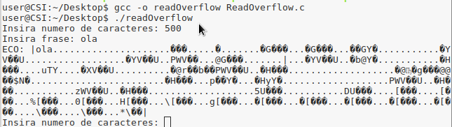

# Pergunta 1.3

Após a análise do código do ficheiro **ReadOverflow.c** podemos concluir que a função começa por ler uma série de caracteres input, através da função *fgets*. De seguida o valor lido, é convertido para inteiro por meio da função *atoi*. Posteriormente lê a frase inserida no input, fazendo por fim *print* dos primeiros n (valor introduzido pelo *user*) caracteres presentes no *buffer*.

No entanto após os testes realizados ao código, pode-se concluir que se consegue extrair informação presente na memória, uma vez que o *buffer* nunca é limpo e o número de caracteres indicado pelo *user* nunca é comparado ao longo do código com o tamanho da frase inserida, pelo que pode haver a ocorrência de *read overflow*, isto é, ler o conteúdo do *buffer* que não foi inserido pela frase escrita no momento mas sim por anteriores.

