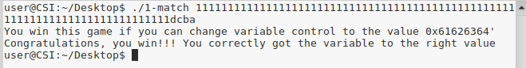

# Pergunta 1.4

Após verificar que a máquina virtual onde foram executados os programas utiliza little endian, ou seja o byte menos significativo é guardado na primeira posição de memória e o mais significativo na última, consultamos a tabela ASCII para obter os caracteres correspondes ao valor hexadecimal 0x61626364. Verificando que os caracteres são a,b,c, e d inserimos um input de tamanho elevado para causar um BufferOverflow e concatenamos no final a string **dcba** que corresponde ao código hexadecimal de maneira a explorar a vulnerabilidade.

