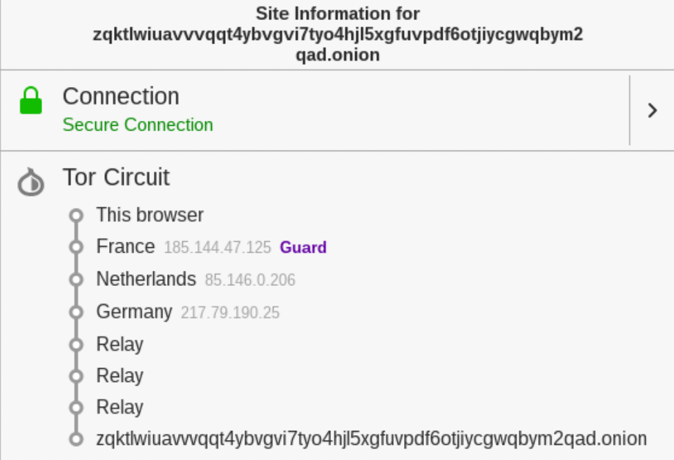

# TP3
## Pergunta P1.2
No seguimento da experiência anterior, aceda a http://zqktlwi4fecvo6ri.onion/wiki/index.php/Main_Page, http://ciadotgov4sjwlzihbbgxnqg3xiyrg7so2r2o3lt5wz5ypk4sxyjstad.onion ou https://www.facebookcorewwwi.onion/.

### 1) 
O site escolhido foi http://zqktlwi4fecvo6ri.onion/wiki/index.php/Main_Page . Este site corresponde a uma página do **The Hidden Wiki**.

Depois de aceder ao site, o circuito obtido foi:

Como podemos ver na imagem em cima o "nosso" Oxion Proxy (OP) começa por conectar-se a um Onion Router (OR) em França, sendo este o nosso *guard* &ast;. Este OR em França irá conectar-se com outro OR, agora na Holanda, e este irá conectar-se ainda com outro na Alemanha.

guard&ast; : *guard* ou *entry guard* é um OR:
* Rápido e estável que permanece sempre como o primeiro OR do nosso circuito. 
* Apenas é substituído por outro OR após 2-3 meses de modo a proteger-nos contra ataques *anonymity-breaking*.

### 2)
O protocolo TOR é um protocolo criptográfico de rede que permite anonimização ponto-a-ponto e permite disponibilizar serviços anónimos sem revelar a localização dos mesmos.
Este protocolo tem como intervenientes os Onion Routers (OR) e o software usado por um utilizador: Onion Proxy(OP).

O protocolo começa com o OP a pré-estabelecer circuitos (normalmente de 3 OR). Este processo de construção do circuito é feito incrementalmente havendo negociação de chaves simétricas com cada OR, um de cada vez. Tudo isto permite a anonimização de um utilizador ou serviço visto que o OP se conecta ao OR(1). Este OR apenas tem conhecimento que nós estamos a utilizar a rede TOR e conecta-se ao OR(2). Este não obtém nenhuma informação útil pois apenas é útil para transporte de informação e conecta-se ao OR(3) que está encriptado. Este último tem acesso à informação limpa enviado pelo OP, mas nada sobre ele.

Assim o nosso browser constrói o circuito segundo os OR demonstrados em cima (situados na França, Holanda e Alemanha) estando o nosso anonimato garantido. Agora para garantirmos o anonimato do serviço serão criados *pontos de rendezvous*. Para tal o OP fornecedor do serviço escolhe alguns *introduction points* que serão anunciados no *Directory Server*, sendo criados também circuitos TOR para cada um destes pontos, estando estes preparados para receber pedidos. Quando um utilizador pretende aceder ao serviço este irá ao *Directory Server* e escolhe um dos OR como *rendezvous point* (RP). Agora vai ser estabelecido um circuito TOR desde o utilizador (anónimo) até a esse RP. A partir daí o utilizador envia uma mensagem com todas as informações necessárias a um dos *introduction points* e será iniciada a troca de chaves entre o serviço e o utilizador. A partir disso temos o utilizador anónimo a usufruir do serviço anónimo.

Assim temos 6 OR: 3 escolhidos pelo utilizador (onde o último OR da cadeia atua como o RP) e 3 escolhidos pelo fornecedor do serviço. Pela figura apresentada em cima podemos reconhecer os primeiros três OR pois estes fazem parte da nossa cadeia. Os últimos 3, os *relay* correspondem aos saltos que nós desconhecemos entre OR desconhecidos que nos permitem chegar ao serviço.
